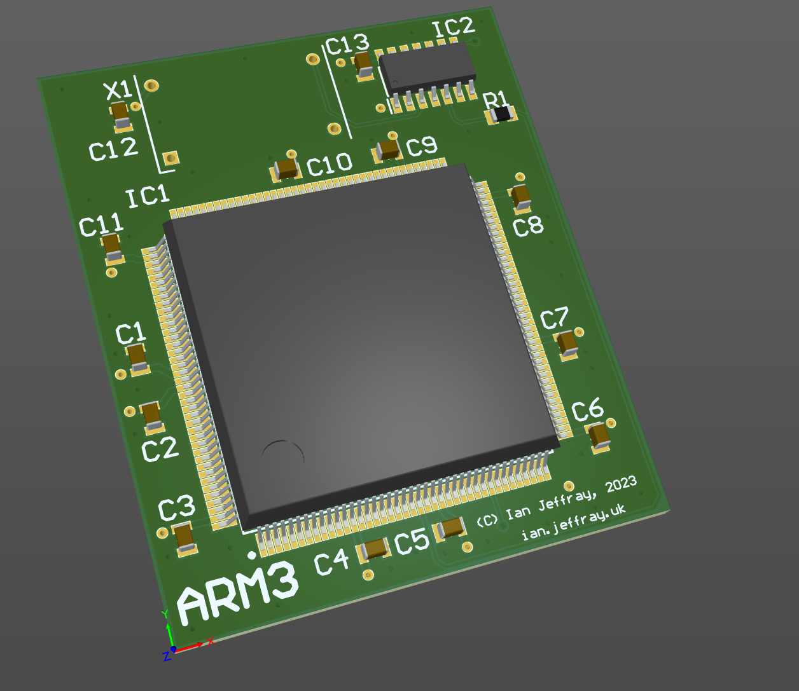

# Acorn Archimedes ARM3 processor card

May 2023

This is my implementation of an ARM3 upgrade card that will plug in to the ARM2 socket on early model Acorn Archimedes machines.

The 1.0 release has been tested successfully over 8 builds using 25MHz and 33MHz parts recovered from dead A5000 machines.  An issue was noted in A4xx/1 machines - the machine will not start due to a missed ABORT pin connection - this issue is specific to the A4xx/1 and corrected in version 1.1 of the design.  A The 1.1 release has been tested successfully in 3 builds with 25MHz parts.

## Licence

No warranty is provided, and this work is used at your own risk.  

Licenced as CC BY-SA 3.0

Copyright 2023 Ian Jeffray

